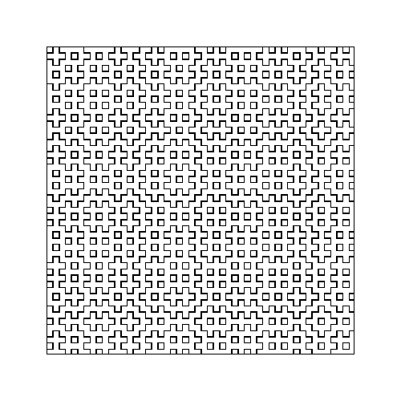
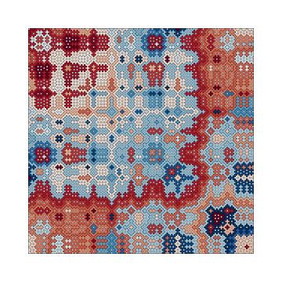
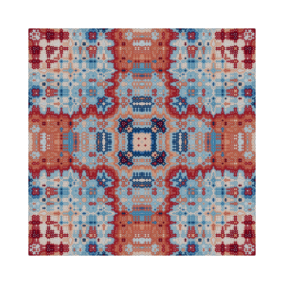
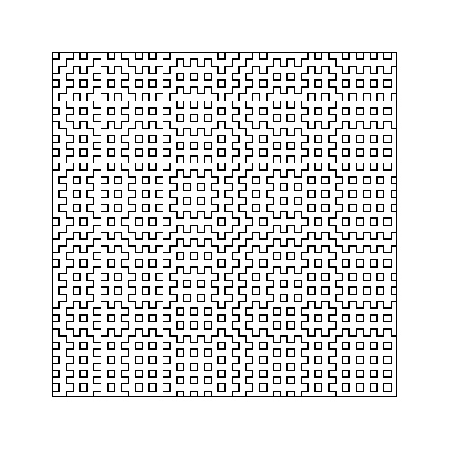
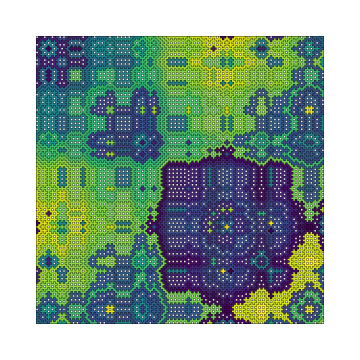
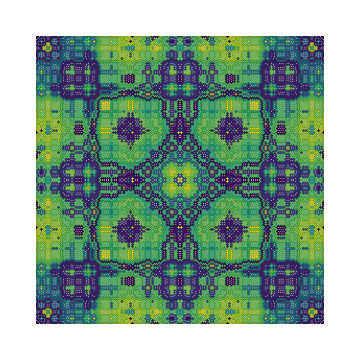
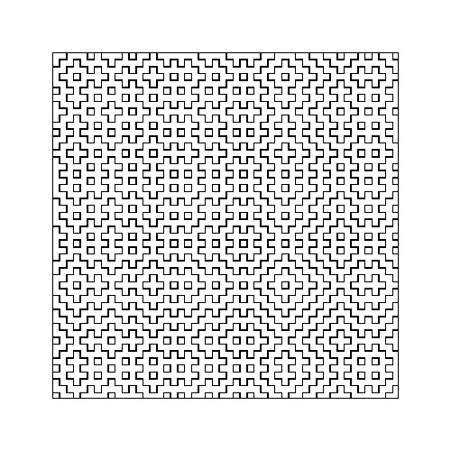
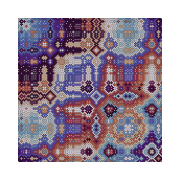
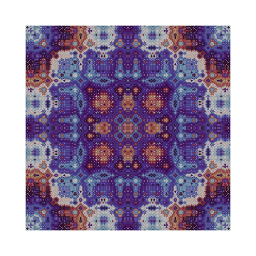

# Hitomezashi

Here I provide some code for te numerical creation of Hitomezashi art.

What is Hitomezashi? Here is an example:

and animated ones:

According to Wikipedia, Hitomezashi is particular form of Sashiko, a form of decorative reinforcement stitching,
see https://en.wikipedia.org/wiki/Sashiko and also
https://www.romordesigns.com/journal/2018/10/18/sashiko-the-art-of-japanese-embroidery for some sewing examples.

I became aware of this thanks to Annie Perkins Math Art Challenge:
https://twitter.com/anniek_p/status/1244220881347502080.
A nice video on the topic is provided by her at:
https://twitter.com/anniek_p/status/1244220881347502080.

The way the Python code [hitomezashi.py](hitomezashi.py) produces the images on this page is as follows: the size of the image is governed by `n_iter`, and the output will draw a `n_iter x n_iter` figure.
The sequence of 1's and 0's (of size `n_iter`) used for the generation (the "seed"), has several options (see below).
The little dash as drawn as follows:

## Column filling:
- If the i-th digit is a 1, start the i-th column by a dash, then a blank, then a dash, then etc.
- If the i-th digit is a 0, start the i-th column by a blank, then a blank, then a dash, then etc.

## Row filling:
- If the i-th digit is a 1, start the i-th row by a dash, then a blank, then a dash, then etc.
- If the i-th digit is a 0, start the i-th row by a blank, then a blank, then a dash, then etc.

The provided code proposes various "seeds", i.e.,  sequences to start the process:

- a random sequence (default)
- the parity of the fractional part of a real number (in the list   )

Type | Black and white             |  Colored | Symmetrized and colored
:-------------------------:|:-------------------------:|:-------------------------:|:-------------------------:
`random` |  |  | 
`exp` |   | | 

 | 
`pi` |   |   | 
`sqrt2` |   |   | 

